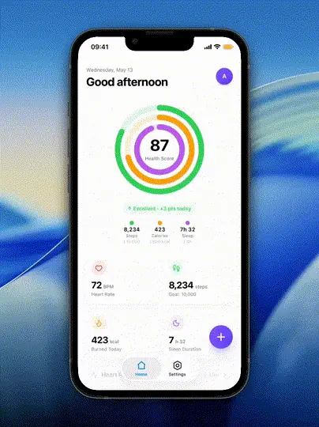
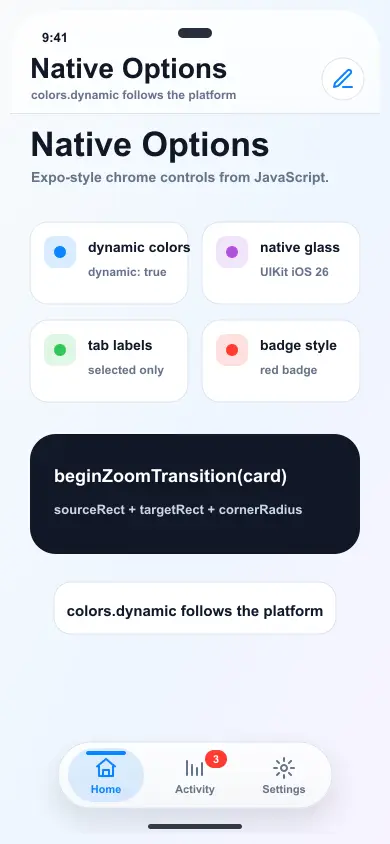
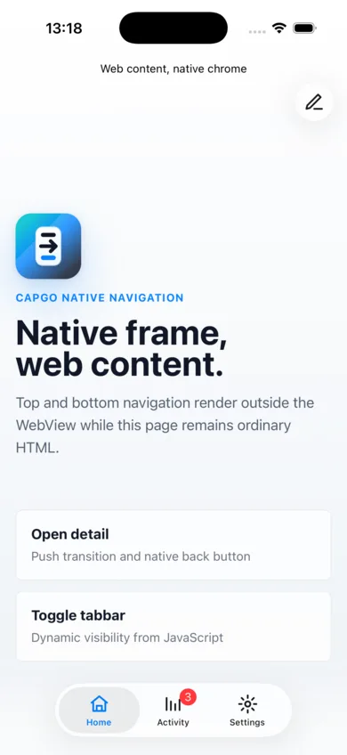
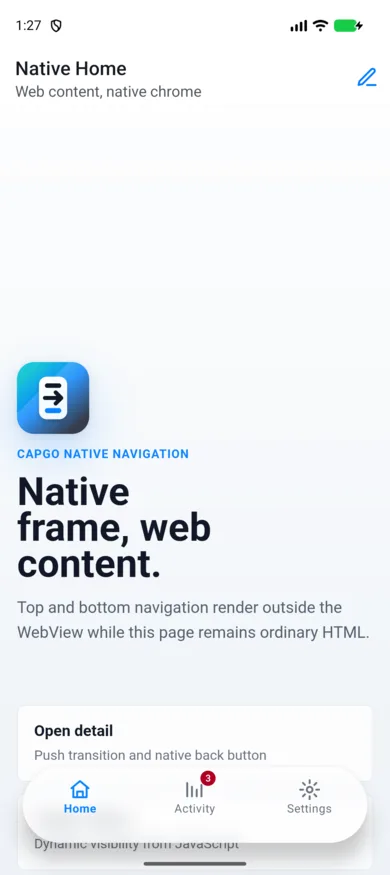
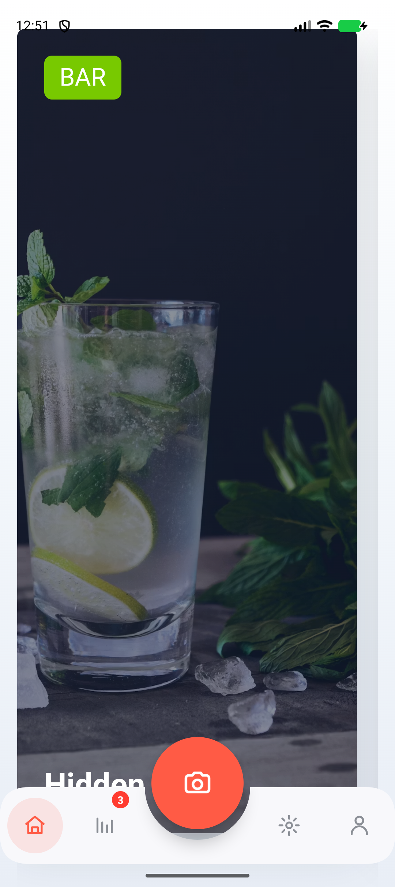

# @capgo/capacitor-native-navigation

<a href="https://capgo.app/">
  
</a>

<div align="center">
  <h2>
    <a href="https://capgo.app/?ref=plugin_native_navigation">Get instant updates for your app with Capgo</a>
  </h2>
  <h2>
    <a href="https://capgo.app/consulting/?ref=plugin_native_navigation">
      Missing a feature? We can build the plugin for you
    </a>
  </h2>
</div>

Native navbar, tabbar, safe-area handling, and WebView snapshot transitions for Capacitor apps. Your web framework keeps routing and page rendering while this plugin owns the platform surfaces users expect to feel native.

## Demo



### Native navigation tap flow


### SVG icon descriptors


### Native styling and zoom options



### Native Liquid Glass screenshots

| iOS native Liquid Glass | Android Liquid Glass style |
| --- | --- |
|  |  |

### Curved native tabbar screenshot



## Features

- Drive native top navigation and bottom tabs from JavaScript state.
- Use system-owned iOS navigation bars, tab bars, tab gestures, and Liquid Glass rendering.
- Emit native intent events such as `navbarBack`, `navbarItemTap`, and `tabSelect`.
- Enable an optional Android Liquid Glass-style blurred backdrop for native bars on Android 12+.
- Capture WebView snapshots for native-feeling push, back, root, tab, and zoom transitions.
- Configure tab labels, selected icons, badges, indicators, ripples, tint colors, and dynamic colors.
- Write CSS inset variables so web content can scroll behind native bars without being hidden.
- Work with React, Vue, Angular, Svelte, Solid, vanilla JS, and any router that exposes imperative navigation.

## How It Fits

- Your router still owns route state and page rendering.
- The app still uses one full-screen WebView.
- Icons must be serializable descriptors such as SVG strings, SF Symbols, or native resource names.

## Compatibility

`@capgo/capacitor-native-navigation` targets Capacitor 8 and Node.js 22+.

## Install

You can use our AI-Assisted Setup to install the plugin. Add the Capgo skills to your AI tool using the following command:

```bash
npx skills add https://github.com/cap-go/capacitor-skills --skill capacitor-plugins
```

Then use the following prompt:

```text
Use the `capacitor-plugins` skill from `cap-go/capacitor-skills` to install the `@capgo/capacitor-native-navigation` plugin in my project.
```

If you prefer Manual Setup, install the plugin by running the following commands and follow the platform-specific instructions below:

```bash
npm install @capgo/capacitor-native-navigation
npx cap sync
```

## Minimal Usage

```typescript
import { NativeNavigation } from '@capgo/capacitor-native-navigation';

await NativeNavigation.configure({
  contentInsetMode: 'css',
  animationDuration: 360,
});

await NativeNavigation.setNavbar({
  title: 'Home',
  subtitle: 'Native chrome',
  transparent: true,
  backButton: { visible: false },
  rightItems: [
    {
      id: 'compose',
      title: 'Compose',
      icon: {
        svg: '<svg viewBox="0 0 24 24" fill="none" stroke="currentColor" stroke-width="2"><path d="M12 20h9"/><path d="M16.5 3.5a2.12 2.12 0 0 1 3 3L7 19l-4 1 1-4Z"/></svg>',
      },
    },
  ],
});

await NativeNavigation.setTabbar({
  selectedId: 'home',
  labelVisibilityMode: 'labeled',
  icons: true,
  colors: {
    dynamic: true,
  },
  tabs: [
    {
      id: 'home',
      title: 'Home',
      icon: {
        svg: '<svg viewBox="0 0 24 24" fill="none" stroke="currentColor" stroke-width="2"><path d="M3 10.5 12 3l9 7.5"/><path d="M5 10v10h14V10"/></svg>',
      },
    },
    {
      id: 'settings',
      title: 'Settings',
      icon: {
        svg: '<svg viewBox="0 0 24 24" fill="none" stroke="currentColor" stroke-width="2"><circle cx="12" cy="12" r="3"/><path d="M12 2v3M12 19v3M2 12h3M19 12h3"/></svg>',
      },
    },
  ],
});

await NativeNavigation.addListener('tabSelect', ({ id }) => {
  router.navigate(`/${id}`);
});
```

## Native Tab Styling

```typescript
await NativeNavigation.setTabbar({
  selectedId: 'home',
  labelVisibilityMode: 'selected',
  indicatorColor: '#0A84FF',
  rippleColor: '#330A84FF',
  badgeBackgroundColor: '#FF3B30',
  badgeTextColor: '#FFFFFF',
  colors: {
    dynamic: true,
    tint: '#0A84FF',
    inactiveTint: '#8E8E93',
  },
  tabs: [
    {
      id: 'home',
      title: 'Home',
      icon: { ios: { sfSymbol: 'house' }, android: { resource: 'ic_home' } },
      selectedIcon: { ios: { sfSymbol: 'house.fill' }, android: { resource: 'ic_home_filled' } },
    },
  ],
});
```

## Android Liquid Glass

Enable `glass.effect: 'liquidGlass'` to draw a live blurred WebView backdrop behind Android native bars. Android 12+ uses a platform `RenderEffect` blur; older Android versions keep the translucent tint surface without live blur.

```typescript
await NativeNavigation.configure({
  glass: {
    effect: 'liquidGlass',
    blurRadius: 18,
    surfaceAlpha: 0.62,
  },
});

await NativeNavigation.setTabbar({
  selectedId: 'home',
  tabs,
  colors: {
    background: '#F8FFFFFF',
  },
});
```

## Transition Flow

```typescript
const transition = await NativeNavigation.beginTransition({ direction: 'forward' });

router.navigate('/detail');
await router.ready?.();

await NativeNavigation.setNavbar({
  title: 'Detail',
  backButton: { visible: true, title: 'Back' },
});

await NativeNavigation.finishTransition({
  id: transition.id,
  direction: 'forward',
});
```

## Use With @capgo/capacitor-transitions

Use `@capgo/capacitor-native-navigation` for the native navbar, tabbar, safe-area insets, and native intent events. Use `@capgo/capacitor-transitions` for the WebView page stack underneath that native chrome.

```bash
npm install @capgo/capacitor-native-navigation @capgo/capacitor-transitions
npx cap sync
```

Initialize both packages once when the app starts:

```typescript
import { NativeNavigation } from '@capgo/capacitor-native-navigation';
import '@capgo/capacitor-transitions';
import { initTransitions, setupRouterOutlet, setDirection } from '@capgo/capacitor-transitions/react';

initTransitions({ platform: 'auto' });

const outlet = document.querySelector('cap-router-outlet');
if (outlet) {
  setupRouterOutlet(outlet, { platform: 'auto', swipeGesture: 'auto' });
}

await NativeNavigation.configure({
  contentInsetMode: 'css',
});
```

Keep the transition outlet focused on pages. Do not render a web header or footer when native chrome owns those surfaces:

```html
<cap-router-outlet platform="auto" swipe-gesture="auto">
  <cap-page>
    <cap-content slot="content" fullscreen>
      <main class="page">Inbox content</main>
    </cap-content>
  </cap-page>
</cap-router-outlet>
```

```css
.page {
  min-height: 100dvh;
  padding-top: var(--cap-native-navigation-top);
  padding-bottom: var(--cap-native-navigation-bottom);
}
```

Drive both packages from the same router actions:

```typescript
async function openMessage(id: string) {
  setDirection('forward');
  await router.push(`/messages/${id}`);
  await NativeNavigation.setNavbar({
    title: 'Message',
    backButton: { visible: true, title: 'Inbox' },
  });
}

await NativeNavigation.addListener('navbarBack', () => {
  setDirection('back');
  router.back();
});

await NativeNavigation.addListener('tabSelect', ({ id }) => {
  setDirection('root');
  router.push(`/${id}`);
});
```

Pick one animation layer per navigation. For normal route pushes, let `@capgo/capacitor-transitions` animate the WebView pages and update native bars with `setNavbar` / `setTabbar`. For shared-element or zoom routes, use `beginZoomTransition` / `finishZoomTransition` from this plugin and skip the web page transition for that navigation.

## Zoom Transition

```typescript
import { beginZoomTransition, finishZoomTransition } from '@capgo/capacitor-native-navigation';

const card = document.querySelector('[data-photo-card]');
if (card) {
  const transition = await beginZoomTransition(card, { cornerRadius: 18 });

  router.navigate('/photo/42');
  await router.ready?.();

  await finishZoomTransition(undefined, {
    id: transition.id,
    cornerRadius: 18,
  });
}
```

## CSS Insets

With `contentInsetMode: 'css'`, the plugin updates these variables on `document.documentElement`:

```css
.app-scroll {
  height: 100dvh;
  overflow: auto;
  padding-top: calc(var(--cap-native-navigation-top) + 24px);
  scroll-padding-bottom: calc(var(--cap-native-navigation-bottom) + 24px);
}

.page {
  min-height: 100dvh;
  padding-bottom: calc(var(--cap-native-navigation-bottom) + 24px);
}
```

Available variables:

- `--cap-native-navigation-top`
- `--cap-native-navigation-right`
- `--cap-native-navigation-bottom`
- `--cap-native-navigation-left`
- `--cap-native-navbar-height`
- `--cap-native-tabbar-height`

## Web Components

The package can register optional custom elements for framework-agnostic declarative setup:

```typescript
import { defineNativeNavigationElements } from '@capgo/capacitor-native-navigation';

defineNativeNavigationElements();
```

```html
<cap-native-navigation-provider enabled="true" content-inset-mode="css"></cap-native-navigation-provider>

<cap-native-navbar
  title="Home"
  subtitle="Native chrome"
  transparent
  right-items='[{"id":"compose","title":"Compose","icon":{"ios":{"sfSymbol":"square.and.pencil"}}}]'
></cap-native-navbar>

<cap-native-tabbar
  selected-id="home"
  tabs='[{"id":"home","title":"Home","icon":{"ios":{"sfSymbol":"house.fill"}}}]'
></cap-native-tabbar>
```

## Icon Descriptors

```typescript
const icon = {
  svg: '<svg viewBox="0 0 24 24" fill="none" stroke="currentColor" stroke-width="2"><path d="M3 10.5 12 3l9 7.5"/></svg>',
  width: 24,
  height: 24,
  template: true,
  src: 'shared_asset_name',
  ios: {
    svg: '<svg viewBox="0 0 24 24"><path d="M3 10.5 12 3l9 7.5"/></svg>',
    sfSymbol: 'house.fill',
    image: 'BundledAssetName',
  },
  android: {
    svg: '<svg viewBox="0 0 24 24"><path d="M3 10.5 12 3l9 7.5"/></svg>',
    resource: 'ic_menu_view',
    image: 'bundled_drawable_name',
  },
};
```

Inline SVG supports the icon-focused subset used by common sets such as Lucide and Feather: `path`, `line`, `polyline`, `polygon`, `circle`, and `rect`. The SVG is rendered as a template image by default, so native tint colors can recolor it without bundling a platform asset.

## Platform Notes

- iOS uses UIKit `UINavigationBar`, `UITabBar`, and `UITabBarController` so the system owns tab interaction, Liquid Glass rendering, and safe-area behavior.
- Android uses an AppCompat `Toolbar` and a native bottom tab surface with edge-to-edge placement.
- Web mirrors inset variables and events for local development.

## Example App

The `example-app/` folder is a vanilla JS Capacitor demo linked with `file:..`.

```bash
cd example-app
npm install
npm run build
npx cap add ios
npx cap add android
npx cap sync
```

## API

<docgen-index>

* [`configure(...)`](#configure)
* [`setNavbar(...)`](#setnavbar)
* [`setTabbar(...)`](#settabbar)
* [`beginTransition(...)`](#begintransition)
* [`finishTransition(...)`](#finishtransition)
* [`getPluginVersion()`](#getpluginversion)
* [`addListener('navbarBack', ...)`](#addlistenernavbarback-)
* [`addListener('navbarItemTap', ...)`](#addlistenernavbaritemtap-)
* [`addListener('tabSelect', ...)`](#addlistenertabselect-)
* [`addListener('safeAreaChanged', ...)`](#addlistenersafeareachanged-)
* [`addListener('transitionStart', ...)`](#addlistenertransitionstart-)
* [`addListener('transitionEnd', ...)`](#addlistenertransitionend-)
* [Interfaces](#interfaces)
* [Type Aliases](#type-aliases)

</docgen-index>

<docgen-api>
<!--Update the source file JSDoc comments and rerun docgen to update the docs below-->

Framework-agnostic native navigation chrome API.

### configure(...)

```typescript
configure(options?: NativeNavigationConfigureOptions | undefined) => Promise<NativeNavigationInsetsResult>
```

Configure the native chrome host and content inset behavior.

| Param         | Type                                                                                          |
| ------------- | --------------------------------------------------------------------------------------------- |
| **`options`** | <code><a href="#nativenavigationconfigureoptions">NativeNavigationConfigureOptions</a></code> |

**Returns:** <code>Promise&lt;<a href="#nativenavigationinsetsresult">NativeNavigationInsetsResult</a>&gt;</code>

--------------------


### setNavbar(...)

```typescript
setNavbar(options: NativeNavigationNavbarOptions) => Promise<NativeNavigationInsetsResult>
```

Render or update the native navbar.

| Param         | Type                                                                                    |
| ------------- | --------------------------------------------------------------------------------------- |
| **`options`** | <code><a href="#nativenavigationnavbaroptions">NativeNavigationNavbarOptions</a></code> |

**Returns:** <code>Promise&lt;<a href="#nativenavigationinsetsresult">NativeNavigationInsetsResult</a>&gt;</code>

--------------------


### setTabbar(...)

```typescript
setTabbar(options: NativeNavigationTabbarOptions) => Promise<NativeNavigationInsetsResult>
```

Render or update the native tabbar.

| Param         | Type                                                                                    |
| ------------- | --------------------------------------------------------------------------------------- |
| **`options`** | <code><a href="#nativenavigationtabbaroptions">NativeNavigationTabbarOptions</a></code> |

**Returns:** <code>Promise&lt;<a href="#nativenavigationinsetsresult">NativeNavigationInsetsResult</a>&gt;</code>

--------------------


### beginTransition(...)

```typescript
beginTransition(options?: NativeNavigationBeginTransitionOptions | undefined) => Promise<NativeNavigationTransitionResult>
```

Capture the current WebView and prepare a native transition.

| Param         | Type                                                                                                      |
| ------------- | --------------------------------------------------------------------------------------------------------- |
| **`options`** | <code><a href="#nativenavigationbegintransitionoptions">NativeNavigationBeginTransitionOptions</a></code> |

**Returns:** <code>Promise&lt;<a href="#nativenavigationtransitionresult">NativeNavigationTransitionResult</a>&gt;</code>

--------------------


### finishTransition(...)

```typescript
finishTransition(options?: NativeNavigationFinishTransitionOptions | undefined) => Promise<NativeNavigationTransitionResult>
```

Animate from the captured WebView snapshot to the current live WebView.

| Param         | Type                                                                                                        |
| ------------- | ----------------------------------------------------------------------------------------------------------- |
| **`options`** | <code><a href="#nativenavigationfinishtransitionoptions">NativeNavigationFinishTransitionOptions</a></code> |

**Returns:** <code>Promise&lt;<a href="#nativenavigationtransitionresult">NativeNavigationTransitionResult</a>&gt;</code>

--------------------


### getPluginVersion()

```typescript
getPluginVersion() => Promise<PluginVersionResult>
```

Returns the platform implementation version marker.

**Returns:** <code>Promise&lt;<a href="#pluginversionresult">PluginVersionResult</a>&gt;</code>

--------------------


### addListener('navbarBack', ...)

```typescript
addListener(eventName: 'navbarBack', listenerFunc: (event: NativeNavigationBackEvent) => void) => Promise<PluginListenerHandle>
```

| Param              | Type                                                                                                |
| ------------------ | --------------------------------------------------------------------------------------------------- |
| **`eventName`**    | <code>'navbarBack'</code>                                                                           |
| **`listenerFunc`** | <code>(event: <a href="#nativenavigationbackevent">NativeNavigationBackEvent</a>) =&gt; void</code> |

**Returns:** <code>Promise&lt;<a href="#pluginlistenerhandle">PluginListenerHandle</a>&gt;</code>

--------------------


### addListener('navbarItemTap', ...)

```typescript
addListener(eventName: 'navbarItemTap', listenerFunc: (event: NativeNavigationBarItemTapEvent) => void) => Promise<PluginListenerHandle>
```

| Param              | Type                                                                                                            |
| ------------------ | --------------------------------------------------------------------------------------------------------------- |
| **`eventName`**    | <code>'navbarItemTap'</code>                                                                                    |
| **`listenerFunc`** | <code>(event: <a href="#nativenavigationbaritemtapevent">NativeNavigationBarItemTapEvent</a>) =&gt; void</code> |

**Returns:** <code>Promise&lt;<a href="#pluginlistenerhandle">PluginListenerHandle</a>&gt;</code>

--------------------


### addListener('tabSelect', ...)

```typescript
addListener(eventName: 'tabSelect', listenerFunc: (event: NativeNavigationTabSelectEvent) => void) => Promise<PluginListenerHandle>
```

| Param              | Type                                                                                                          |
| ------------------ | ------------------------------------------------------------------------------------------------------------- |
| **`eventName`**    | <code>'tabSelect'</code>                                                                                      |
| **`listenerFunc`** | <code>(event: <a href="#nativenavigationtabselectevent">NativeNavigationTabSelectEvent</a>) =&gt; void</code> |

**Returns:** <code>Promise&lt;<a href="#pluginlistenerhandle">PluginListenerHandle</a>&gt;</code>

--------------------


### addListener('safeAreaChanged', ...)

```typescript
addListener(eventName: 'safeAreaChanged', listenerFunc: (event: NativeNavigationSafeAreaChangedEvent) => void) => Promise<PluginListenerHandle>
```

| Param              | Type                                                                                                                      |
| ------------------ | ------------------------------------------------------------------------------------------------------------------------- |
| **`eventName`**    | <code>'safeAreaChanged'</code>                                                                                            |
| **`listenerFunc`** | <code>(event: <a href="#nativenavigationsafeareachangedevent">NativeNavigationSafeAreaChangedEvent</a>) =&gt; void</code> |

**Returns:** <code>Promise&lt;<a href="#pluginlistenerhandle">PluginListenerHandle</a>&gt;</code>

--------------------


### addListener('transitionStart', ...)

```typescript
addListener(eventName: 'transitionStart', listenerFunc: (event: NativeNavigationTransitionEvent) => void) => Promise<PluginListenerHandle>
```

| Param              | Type                                                                                                            |
| ------------------ | --------------------------------------------------------------------------------------------------------------- |
| **`eventName`**    | <code>'transitionStart'</code>                                                                                  |
| **`listenerFunc`** | <code>(event: <a href="#nativenavigationtransitionevent">NativeNavigationTransitionEvent</a>) =&gt; void</code> |

**Returns:** <code>Promise&lt;<a href="#pluginlistenerhandle">PluginListenerHandle</a>&gt;</code>

--------------------


### addListener('transitionEnd', ...)

```typescript
addListener(eventName: 'transitionEnd', listenerFunc: (event: NativeNavigationTransitionEvent) => void) => Promise<PluginListenerHandle>
```

| Param              | Type                                                                                                            |
| ------------------ | --------------------------------------------------------------------------------------------------------------- |
| **`eventName`**    | <code>'transitionEnd'</code>                                                                                    |
| **`listenerFunc`** | <code>(event: <a href="#nativenavigationtransitionevent">NativeNavigationTransitionEvent</a>) =&gt; void</code> |

**Returns:** <code>Promise&lt;<a href="#pluginlistenerhandle">PluginListenerHandle</a>&gt;</code>

--------------------


### Interfaces


#### NativeNavigationInsetsResult

Returned by methods that may change safe content bounds.

| Prop         | Type                                                                      |
| ------------ | ------------------------------------------------------------------------- |
| **`insets`** | <code><a href="#nativenavigationinsets">NativeNavigationInsets</a></code> |


#### NativeNavigationInsets

Insets exposed to web content.

| Prop               | Type                |
| ------------------ | ------------------- |
| **`top`**          | <code>number</code> |
| **`right`**        | <code>number</code> |
| **`bottom`**       | <code>number</code> |
| **`left`**         | <code>number</code> |
| **`navbarHeight`** | <code>number</code> |
| **`tabbarHeight`** | <code>number</code> |


#### NativeNavigationConfigureOptions

Global plugin configuration.

| Prop                    | Type                                                                                          | Description                                                                |
| ----------------------- | --------------------------------------------------------------------------------------------- | -------------------------------------------------------------------------- |
| **`enabled`**           | <code>boolean</code>                                                                          | Enables or disables the native chrome host.                                |
| **`platformStyle`**     | <code><a href="#nativenavigationplatformstyle">NativeNavigationPlatformStyle</a></code>       | Native style preference. `auto` uses the current platform.                 |
| **`contentInsetMode`**  | <code><a href="#nativenavigationcontentinsetmode">NativeNavigationContentInsetMode</a></code> | When `css`, the plugin writes CSS variables on `document.documentElement`. |
| **`animationDuration`** | <code>number</code>                                                                           | Default native transition duration in milliseconds.                        |
| **`colors`**            | <code><a href="#nativenavigationcolors">NativeNavigationColors</a></code>                     | Shared color hints for native bars.                                        |
| **`glass`**             | <code><a href="#nativenavigationglassoptions">NativeNavigationGlassOptions</a></code>         | Shared glass background defaults for native bars.                          |


#### NativeNavigationColors

Native bar colors. Use CSS-style hex strings (`#RRGGBB` or `#AARRGGBB`).

| Prop                  | Type                 | Description                                                                                                                 |
| --------------------- | -------------------- | --------------------------------------------------------------------------------------------------------------------------- |
| **`dynamic`**         | <code>boolean</code> | When `true`, Android 12+ derives unspecified bar colors from Material You system palettes. Explicit color fields still win. |
| **`tint`**            | <code>string</code>  | Tint color for active buttons/items.                                                                                        |
| **`inactiveTint`**    | <code>string</code>  | Color for inactive tab items. Ignored on iOS 26+ unless `experimentalBakedTintColors` is enabled.                           |
| **`background`**      | <code>string</code>  | Optional background tint. Ignored on iOS 26+ so UIKit can preserve the system Liquid Glass navigation appearance.           |
| **`foreground`**      | <code>string</code>  | Title and label text color where the native platform supports it.                                                           |
| **`badgeBackground`** | <code>string</code>  | Badge background color for native tab badges.                                                                               |
| **`badgeText`**       | <code>string</code>  | Badge text color for native tab badges.                                                                                     |
| **`indicator`**       | <code>string</code>  | Active tab indicator color on Android.                                                                                      |
| **`ripple`**          | <code>string</code>  | Tab press ripple color on Android.                                                                                          |


#### NativeNavigationGlassOptions

Native glass background configuration.

| Prop               | Type                                                                                | Description                                                                                                                                                                                       |
| ------------------ | ----------------------------------------------------------------------------------- | ------------------------------------------------------------------------------------------------------------------------------------------------------------------------------------------------- |
| **`effect`**       | <code><a href="#nativenavigationglasseffect">NativeNavigationGlassEffect</a></code> | `liquidGlass` enables the Android 12+ live blurred WebView backdrop for native bars. Android 11 and older keep a translucent surface fallback. iOS uses the platform-owned Liquid Glass behavior. |
| **`blurRadius`**   | <code>number</code>                                                                 | Android blur radius in native dp for `liquidGlass`. Defaults to `18`.                                                                                                                             |
| **`surfaceAlpha`** | <code>number</code>                                                                 | Alpha multiplier for the tint surface over the glass backdrop. Defaults to `0.62`.                                                                                                                |


#### NativeNavigationNavbarOptions

Native navbar state.

| Prop              | Type                                                                                  | Description                                                                                                                              |
| ----------------- | ------------------------------------------------------------------------------------- | ---------------------------------------------------------------------------------------------------------------------------------------- |
| **`hidden`**      | <code>boolean</code>                                                                  | Hide the native navbar.                                                                                                                  |
| **`title`**       | <code>string</code>                                                                   | Main title.                                                                                                                              |
| **`subtitle`**    | <code>string</code>                                                                   | Secondary title where supported by the platform.                                                                                         |
| **`large`**       | <code>boolean</code>                                                                  | Prefer a large iOS title style.                                                                                                          |
| **`transparent`** | <code>boolean</code>                                                                  | Prefer transparent/scroll-edge style.                                                                                                    |
| **`blurEffect`**  | <code><a href="#nativenavigationblureffect">NativeNavigationBlurEffect</a></code>     | iOS blur/material effect for the navbar background when glass is not available. Defaults to `systemChromeMaterial` for transparent bars. |
| **`glass`**       | <code><a href="#nativenavigationglassoptions">NativeNavigationGlassOptions</a></code> | Optional glass background behavior. Overrides `configure({ glass })` for this navbar update.                                             |
| **`backButton`**  | <code><a href="#nativenavigationbackbutton">NativeNavigationBackButton</a></code>     | Back button state.                                                                                                                       |
| **`leftItems`**   | <code>NativeNavigationBarButton[]</code>                                              | Left-side action buttons.                                                                                                                |
| **`rightItems`**  | <code>NativeNavigationBarButton[]</code>                                              | Right-side action buttons.                                                                                                               |
| **`colors`**      | <code><a href="#nativenavigationcolors">NativeNavigationColors</a></code>             | Navbar color hints.                                                                                                                      |
| **`animated`**    | <code>boolean</code>                                                                  | Animate native navbar changes.                                                                                                           |


#### NativeNavigationBackButton

Native back button configuration.

| Prop          | Type                 | Description                      |
| ------------- | -------------------- | -------------------------------- |
| **`visible`** | <code>boolean</code> | Show the native back affordance. |
| **`title`**   | <code>string</code>  | Optional back title.             |


#### NativeNavigationBarButton

A button shown in the native navbar.

| Prop          | Type                                                                  | Description                                        |
| ------------- | --------------------------------------------------------------------- | -------------------------------------------------- |
| **`id`**      | <code>string</code>                                                   | Stable id returned in `navbarItemTap`.             |
| **`title`**   | <code>string</code>                                                   | Visible text label.                                |
| **`icon`**    | <code><a href="#nativenavigationicon">NativeNavigationIcon</a></code> | Native icon descriptor.                            |
| **`enabled`** | <code>boolean</code>                                                  | Whether the action is enabled. Defaults to `true`. |


#### NativeNavigationIcon

A serializable icon descriptor. Framework nodes are intentionally not accepted
because icons are rendered by native UI.

| Prop           | Type                                                              | Description                                                                                                                                                                                                                        |
| -------------- | ----------------------------------------------------------------- | ---------------------------------------------------------------------------------------------------------------------------------------------------------------------------------------------------------------------------------- |
| **`src`**      | <code>string</code>                                               | Cross-platform asset path or URL fallback.                                                                                                                                                                                         |
| **`svg`**      | <code>string</code>                                               | Cross-platform inline SVG markup. The native renderers support common icon shapes such as path, line, polyline, polygon, circle, and rect. SVG icons are rendered as template images by default so native tint colors still apply. |
| **`width`**    | <code>number</code>                                               | Preferred rendered icon width in native points/dp. Defaults to `24`.                                                                                                                                                               |
| **`height`**   | <code>number</code>                                               | Preferred rendered icon height in native points/dp. Defaults to `24`.                                                                                                                                                              |
| **`template`** | <code>boolean</code>                                              | When `true`, native tint colors are applied to the rendered SVG/image. Defaults to `true`.                                                                                                                                         |
| **`ios`**      | <code>{ sfSymbol?: string; image?: string; svg?: string; }</code> | iOS-specific SF Symbol, bundled image name, or inline SVG.                                                                                                                                                                         |
| **`android`**  | <code>{ resource?: string; image?: string; svg?: string; }</code> | Android-specific drawable resource, asset name, or inline SVG.                                                                                                                                                                     |


#### NativeNavigationTabbarOptions

Native tabbar state.

| Prop                                 | Type                                                                                                      | Description                                                                                                                                                                                     |
| ------------------------------------ | --------------------------------------------------------------------------------------------------------- | ----------------------------------------------------------------------------------------------------------------------------------------------------------------------------------------------- |
| **`hidden`**                         | <code>boolean</code>                                                                                      | Hide the native tabbar.                                                                                                                                                                         |
| **`tabs`**                           | <code>NativeNavigationTab[]</code>                                                                        | Tab definitions.                                                                                                                                                                                |
| **`selectedId`**                     | <code>string</code>                                                                                       | Currently selected tab id.                                                                                                                                                                      |
| **`labels`**                         | <code>boolean</code>                                                                                      | Show text labels. Defaults to `true`.                                                                                                                                                           |
| **`labelVisibilityMode`**            | <code><a href="#nativenavigationtablabelvisibilitymode">NativeNavigationTabLabelVisibilityMode</a></code> | Native label visibility mode. Overrides `labels` when provided.                                                                                                                                 |
| **`icons`**                          | <code>boolean</code>                                                                                      | Show icons. Defaults to `true`.                                                                                                                                                                 |
| **`colors`**                         | <code><a href="#nativenavigationcolors">NativeNavigationColors</a></code>                                 | Tabbar color hints.                                                                                                                                                                             |
| **`blurEffect`**                     | <code><a href="#nativenavigationblureffect">NativeNavigationBlurEffect</a></code>                         | iOS blur/material effect for the tabbar background when glass is not available.                                                                                                                 |
| **`glass`**                          | <code><a href="#nativenavigationglassoptions">NativeNavigationGlassOptions</a></code>                     | Optional glass background behavior. Overrides `configure({ glass })` for this tabbar update.                                                                                                    |
| **`experimentalBakedTintColors`**    | <code>boolean</code>                                                                                      | Opt into the iOS 26 Liquid Glass tint workaround that renders active and inactive tab items into baked images. This can affect badge positioning and icon sizing, so it is disabled by default. |
| **`disableTransparentOnScrollEdge`** | <code>boolean</code>                                                                                      | Keep the iOS scroll-edge tabbar appearance from becoming transparent. Mirrors Expo Router native tabs' `disableTransparentOnScrollEdge` option. Defaults to `false`.                            |
| **`disableIndicator`**               | <code>boolean</code>                                                                                      | Disable the Android active tab indicator.                                                                                                                                                       |
| **`indicatorColor`**                 | <code>string</code>                                                                                       | Active tab indicator color on Android. `colors.indicator` is also supported.                                                                                                                    |
| **`rippleColor`**                    | <code>string</code>                                                                                       | Tab press ripple color on Android. `colors.ripple` is also supported.                                                                                                                           |
| **`badgeBackgroundColor`**           | <code>string</code>                                                                                       | Badge background color. `colors.badgeBackground` is also supported.                                                                                                                             |
| **`badgeTextColor`**                 | <code>string</code>                                                                                       | Badge text color. `colors.badgeText` is also supported.                                                                                                                                         |
| **`style`**                          | <code><a href="#nativenavigationtabbarstyle">NativeNavigationTabbarStyle</a></code>                       | Optional native tabbar layout and shape customization.                                                                                                                                          |
| **`animated`**                       | <code>boolean</code>                                                                                      | Animate native tabbar changes.                                                                                                                                                                  |


#### NativeNavigationTab

A native tab item.

| Prop               | Type                                                                  | Description                                                                                                                                               |
| ------------------ | --------------------------------------------------------------------- | --------------------------------------------------------------------------------------------------------------------------------------------------------- |
| **`id`**           | <code>string</code>                                                   | Stable tab id returned in `tabSelect`.                                                                                                                    |
| **`title`**        | <code>string</code>                                                   | Visible tab label.                                                                                                                                        |
| **`icon`**         | <code><a href="#nativenavigationicon">NativeNavigationIcon</a></code> | Native icon descriptor.                                                                                                                                   |
| **`selectedIcon`** | <code><a href="#nativenavigationicon">NativeNavigationIcon</a></code> | Optional selected-state icon.                                                                                                                             |
| **`badge`**        | <code>string \| number</code>                                         | Optional badge. Numeric badges are supported on both platforms; text badge support depends on platform capabilities.                                      |
| **`enabled`**      | <code>boolean</code>                                                  | Whether the tab is enabled. Defaults to `true`.                                                                                                           |
| **`hidden`**       | <code>boolean</code>                                                  | Hide the tab item from the native tabbar. When the hidden tab is selected, native platform constraints may keep it visible until another tab is selected. |


#### NativeNavigationTabbarStyle

Native tabbar layout and background shape options.

| Prop                        | Type                                                                                | Description                                                                                                                            |
| --------------------------- | ----------------------------------------------------------------------------------- | -------------------------------------------------------------------------------------------------------------------------------------- |
| **`shape`**                 | <code><a href="#nativenavigationtabbarshape">NativeNavigationTabbarShape</a></code> | `floating` keeps the existing capsule tabbar. `curve` draws a full-width bar with a center notch and raised center tab.                |
| **`height`**                | <code>number</code>                                                                 | Bar height in native points/dp. Defaults to `64` for `floating` and `76` for `curve`.                                                  |
| **`horizontalMargin`**      | <code>number</code>                                                                 | Horizontal margin in native points/dp. Defaults to `24` for `floating` and `0` for `curve`.                                            |
| **`maxWidth`**              | <code>number</code>                                                                 | Maximum tabbar width in native points/dp. Defaults to `430` for `floating`; `curve` uses the available width unless this is set.       |
| **`bottomGap`**             | <code>number</code>                                                                 | Bottom gap above the platform safe area in native points/dp. Defaults to `10` for `floating` and `0` for `curve`.                      |
| **`cornerRadius`**          | <code>number</code>                                                                 | Background corner radius in native points/dp. Defaults to a capsule radius for `floating` and `24` for `curve`.                        |
| **`centerItemId`**          | <code>string</code>                                                                 | Tab id promoted into the raised center button for `curve`. Defaults to the middle tab.                                                 |
| **`centerButtonDiameter`**  | <code>number</code>                                                                 | Raised center button diameter in native points/dp. Defaults to `76`.                                                                   |
| **`centerButtonLift`**      | <code>number</code>                                                                 | Distance from the top of the center button to the top edge of the bar in native points/dp. Defaults to half of `centerButtonDiameter`. |
| **`centerButtonColor`**     | <code>string</code>                                                                 | Raised center button color. Defaults to the active tint color.                                                                         |
| **`centerButtonIconColor`** | <code>string</code>                                                                 | Raised center button icon color. Defaults to white.                                                                                    |


#### NativeNavigationTransitionResult

Native transition result.

| Prop            | Type                                                                                                |
| --------------- | --------------------------------------------------------------------------------------------------- |
| **`id`**        | <code>string</code>                                                                                 |
| **`direction`** | <code><a href="#nativenavigationtransitiondirection">NativeNavigationTransitionDirection</a></code> |
| **`duration`**  | <code>number</code>                                                                                 |


#### NativeNavigationBeginTransitionOptions

Begin a native transition transaction before JS changes route content.

| Prop               | Type                                                                                                | Description                                                                                                                    |
| ------------------ | --------------------------------------------------------------------------------------------------- | ------------------------------------------------------------------------------------------------------------------------------ |
| **`id`**           | <code>string</code>                                                                                 |                                                                                                                                |
| **`direction`**    | <code><a href="#nativenavigationtransitiondirection">NativeNavigationTransitionDirection</a></code> |                                                                                                                                |
| **`duration`**     | <code>number</code>                                                                                 |                                                                                                                                |
| **`sourceRect`**   | <code><a href="#nativenavigationrect">NativeNavigationRect</a></code>                               | Source rectangle for `zoom` transitions. Use viewport coordinates such as those returned by `Element.getBoundingClientRect()`. |
| **`targetRect`**   | <code><a href="#nativenavigationrect">NativeNavigationRect</a></code>                               | Destination rectangle for shared-element-style `zoom` transitions.                                                             |
| **`cornerRadius`** | <code>number</code>                                                                                 | Corner radius used while animating a `zoom` transition.                                                                        |


#### NativeNavigationRect

A rectangle in WebView viewport coordinates, expressed in native points/dp.

| Prop         | Type                |
| ------------ | ------------------- |
| **`x`**      | <code>number</code> |
| **`y`**      | <code>number</code> |
| **`width`**  | <code>number</code> |
| **`height`** | <code>number</code> |


#### NativeNavigationFinishTransitionOptions

Finish a native transition transaction after JS has changed route content.

| Prop               | Type                                                                                                | Description                                                                 |
| ------------------ | --------------------------------------------------------------------------------------------------- | --------------------------------------------------------------------------- |
| **`id`**           | <code>string</code>                                                                                 |                                                                             |
| **`direction`**    | <code><a href="#nativenavigationtransitiondirection">NativeNavigationTransitionDirection</a></code> |                                                                             |
| **`duration`**     | <code>number</code>                                                                                 |                                                                             |
| **`sourceRect`**   | <code><a href="#nativenavigationrect">NativeNavigationRect</a></code>                               | Source rectangle for `zoom` transitions when no active source was recorded. |
| **`targetRect`**   | <code><a href="#nativenavigationrect">NativeNavigationRect</a></code>                               | Destination rectangle for shared-element-style `zoom` transitions.          |
| **`cornerRadius`** | <code>number</code>                                                                                 | Corner radius used while animating a `zoom` transition.                     |


#### PluginVersionResult

Plugin version payload.

| Prop          | Type                | Description                                                 |
| ------------- | ------------------- | ----------------------------------------------------------- |
| **`version`** | <code>string</code> | Version identifier returned by the platform implementation. |


#### PluginListenerHandle

| Prop         | Type                                      |
| ------------ | ----------------------------------------- |
| **`remove`** | <code>() =&gt; Promise&lt;void&gt;</code> |


#### NativeNavigationBackEvent

| Prop         | Type                  |
| ------------ | --------------------- |
| **`source`** | <code>'navbar'</code> |


#### NativeNavigationBarItemTapEvent

| Prop            | Type                           |
| --------------- | ------------------------------ |
| **`id`**        | <code>string</code>            |
| **`title`**     | <code>string</code>            |
| **`placement`** | <code>'left' \| 'right'</code> |


#### NativeNavigationTabSelectEvent

| Prop        | Type                |
| ----------- | ------------------- |
| **`id`**    | <code>string</code> |
| **`index`** | <code>number</code> |
| **`title`** | <code>string</code> |


#### NativeNavigationSafeAreaChangedEvent

| Prop         | Type                                                                      |
| ------------ | ------------------------------------------------------------------------- |
| **`insets`** | <code><a href="#nativenavigationinsets">NativeNavigationInsets</a></code> |


#### NativeNavigationTransitionEvent

| Prop            | Type                                                                                                |
| --------------- | --------------------------------------------------------------------------------------------------- |
| **`id`**        | <code>string</code>                                                                                 |
| **`direction`** | <code><a href="#nativenavigationtransitiondirection">NativeNavigationTransitionDirection</a></code> |
| **`duration`**  | <code>number</code>                                                                                 |


### Type Aliases


#### NativeNavigationPlatformStyle

Platform rendering preference for the native bars.

<code>'auto' | 'ios' | 'android'</code>


#### NativeNavigationContentInsetMode

How the plugin exposes native bar sizes to web content.

<code>'css' | 'none'</code>


#### NativeNavigationGlassEffect

Native glass background rendering preference.

<code>'none' | 'liquidGlass'</code>


#### NativeNavigationBlurEffect

Native material/blur effect preference.

<code>'none' | 'systemDefault' | 'extraLight' | 'light' | 'dark' | 'regular' | 'prominent' | 'systemUltraThinMaterial' | 'systemThinMaterial' | 'systemMaterial' | 'systemThickMaterial' | 'systemChromeMaterial' | 'systemUltraThinMaterialLight' | 'systemThinMaterialLight' | 'systemMaterialLight' | 'systemThickMaterialLight' | 'systemChromeMaterialLight' | 'systemUltraThinMaterialDark' | 'systemThinMaterialDark' | 'systemMaterialDark' | 'systemThickMaterialDark' | 'systemChromeMaterialDark'</code>


#### NativeNavigationTabLabelVisibilityMode

Native tab label visibility behavior.

<code>'auto' | 'selected' | 'labeled' | 'unlabeled'</code>


#### NativeNavigationTabbarShape

Native tabbar background shape.

<code>'floating' | 'curve'</code>


#### NativeNavigationTransitionDirection

Navigation animation direction.

<code>'forward' | 'back' | 'root' | 'tab' | 'zoom' | 'none'</code>

</docgen-api>
