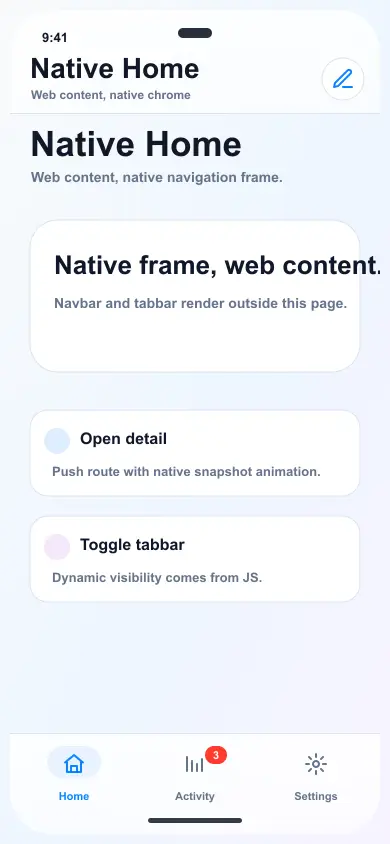
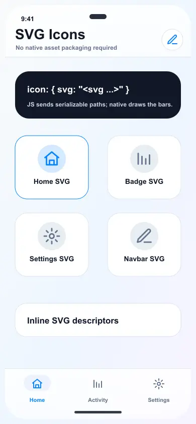

# @capgo/native-navigation
<a href="https://capgo.app/"></a>

<div align="center">
  <h2><a href="https://capgo.app/?ref=plugin_native_navigation">Get instant updates for your app with Capgo</a></h2>
  <h2><a href="https://capgo.app/consulting/?ref=plugin_native_navigation">Missing a feature? We can build the plugin for you</a></h2>
</div>

Native navigation chrome for Capacitor apps. Render a native navbar, native tabbar, and native transition shell over a single full-screen WebView while your framework keeps owning routes and content.

## Demo

### Native navigation tap flow



### SVG icon descriptors



## What It Does

- Renders native top navigation and bottom tab chrome from JavaScript state.
- Emits native intent events such as `navbarBack`, `navbarItemTap`, and `tabSelect`.
- Captures WebView snapshots for native-feeling push, back, root, and tab transition shells.
- Writes CSS variables so web content can scroll behind native bars without being hidden.
- Works with React, Vue, Angular, Svelte, Solid, vanilla JS, and any router that can call imperative methods.

## What It Does Not Do

- It does not create one native WebView per route.
- It does not render React/Vue/Svelte icon nodes natively. Icons must be serializable descriptors such as SVG strings, SF Symbols, or native resource names.
- It does not replace your router. JS still owns route state and web content rendering.

## Compatibility

| Plugin version | Capacitor compatibility | Maintained |
| -------------- | ----------------------- | ---------- |
| v8.\*.\*       | v8.\*.\*                | Yes        |
| v7.\*.\*       | v7.\*.\*                | On demand   |
| v6.\*.\*       | v6.\*.\*                | On demand   |

## Install

```bash
bun add @capgo/native-navigation
bunx cap sync
```

## Minimal Usage

```typescript
import { NativeNavigation } from '@capgo/native-navigation';

await NativeNavigation.configure({
  contentInsetMode: 'css',
  animationDuration: 360,
});

await NativeNavigation.setNavbar({
  title: 'Home',
  subtitle: 'Native chrome',
  transparent: true,
  backButton: { visible: false },
  rightItems: [
    {
      id: 'compose',
      title: 'Compose',
      icon: {
        svg: '<svg viewBox="0 0 24 24" fill="none" stroke="currentColor" stroke-width="2"><path d="M12 20h9"/><path d="M16.5 3.5a2.12 2.12 0 0 1 3 3L7 19l-4 1 1-4Z"/></svg>',
      },
    },
  ],
});

await NativeNavigation.setTabbar({
  selectedId: 'home',
  labels: true,
  icons: true,
  tabs: [
    {
      id: 'home',
      title: 'Home',
      icon: {
        svg: '<svg viewBox="0 0 24 24" fill="none" stroke="currentColor" stroke-width="2"><path d="M3 10.5 12 3l9 7.5"/><path d="M5 10v10h14V10"/></svg>',
      },
    },
    {
      id: 'settings',
      title: 'Settings',
      icon: {
        svg: '<svg viewBox="0 0 24 24" fill="none" stroke="currentColor" stroke-width="2"><circle cx="12" cy="12" r="3"/><path d="M12 2v3M12 19v3M2 12h3M19 12h3"/></svg>',
      },
    },
  ],
});

NativeNavigation.addListener('tabSelect', ({ id }) => {
  router.navigate(id);
});
```

## Transition Flow

```typescript
const transition = await NativeNavigation.beginTransition({ direction: 'forward' });

router.navigate('/detail');
await router.ready?.();

await NativeNavigation.setNavbar({
  title: 'Detail',
  backButton: { visible: true, title: 'Back' },
});

await NativeNavigation.finishTransition({
  id: transition.id,
  direction: 'forward',
});
```

## CSS Insets

With `contentInsetMode: 'css'`, the plugin updates these variables on `document.documentElement`:

```css
.app-scroll {
  height: 100dvh;
  overflow: auto;
  padding-top: calc(var(--cap-native-navigation-top) + 24px);
  scroll-padding-bottom: calc(var(--cap-native-navigation-bottom) + 24px);
}

.page {
  min-height: 100dvh;
  padding-bottom: calc(var(--cap-native-navigation-bottom) + 24px);
}
```

Available variables:

- `--cap-native-navigation-top`
- `--cap-native-navigation-right`
- `--cap-native-navigation-bottom`
- `--cap-native-navigation-left`
- `--cap-native-navbar-height`
- `--cap-native-tabbar-height`

## Web Components

The package can register optional custom elements for framework-agnostic declarative setup:

```typescript
import { defineNativeNavigationElements } from '@capgo/native-navigation';

defineNativeNavigationElements();
```

```html
<cap-native-navigation-provider enabled="true" content-inset-mode="css"></cap-native-navigation-provider>

<cap-native-navbar
  title="Home"
  subtitle="Native chrome"
  transparent
  right-items='[{"id":"compose","title":"Compose","icon":{"ios":{"sfSymbol":"square.and.pencil"}}}]'
></cap-native-navbar>

<cap-native-tabbar
  selected-id="home"
  tabs='[{"id":"home","title":"Home","icon":{"ios":{"sfSymbol":"house.fill"}}}]'
></cap-native-tabbar>
```

## Icon Descriptors

```typescript
const icon = {
  svg: '<svg viewBox="0 0 24 24" fill="none" stroke="currentColor" stroke-width="2"><path d="M3 10.5 12 3l9 7.5"/></svg>',
  width: 24,
  height: 24,
  template: true,
  src: 'fallback_asset_name',
  ios: {
    svg: '<svg viewBox="0 0 24 24"><path d="M3 10.5 12 3l9 7.5"/></svg>',
    sfSymbol: 'house.fill',
    image: 'BundledAssetName',
  },
  android: {
    svg: '<svg viewBox="0 0 24 24"><path d="M3 10.5 12 3l9 7.5"/></svg>',
    resource: 'ic_menu_view',
    image: 'bundled_drawable_name',
  },
};
```

Inline SVG supports the icon-focused subset used by common sets such as Lucide and Feather: `path`, `line`, `polyline`, `polygon`, `circle`, and `rect`. The SVG is rendered as a template image by default, so native tint colors can recolor it without bundling a platform asset.

## Platform Notes

- iOS uses `UINavigationBar` and a floating native UIKit tab capsule. iOS 26+ relies on the system Liquid Glass effect where available; earlier versions use native translucent/material fallback styling.
- Android uses an AppCompat `Toolbar` and a floating native tab capsule with edge-to-edge placement.
- Web fallback does not draw native bars; it mirrors inset variables and events for development.

## Example App

The `example-app/` folder is a vanilla JS Capacitor demo linked with `file:..`.

```bash
cd example-app
bun install
bun run build
bunx cap add ios
bunx cap add android
bunx cap sync
```

## API

<docgen-index>

* [`configure(...)`](#configure)
* [`setNavbar(...)`](#setnavbar)
* [`setTabbar(...)`](#settabbar)
* [`beginTransition(...)`](#begintransition)
* [`finishTransition(...)`](#finishtransition)
* [`getPluginVersion()`](#getpluginversion)
* [`addListener('navbarBack', ...)`](#addlistenernavbarback-)
* [`addListener('navbarItemTap', ...)`](#addlistenernavbaritemtap-)
* [`addListener('tabSelect', ...)`](#addlistenertabselect-)
* [`addListener('safeAreaChanged', ...)`](#addlistenersafeareachanged-)
* [`addListener('transitionStart', ...)`](#addlistenertransitionstart-)
* [`addListener('transitionEnd', ...)`](#addlistenertransitionend-)
* [Interfaces](#interfaces)
* [Type Aliases](#type-aliases)

</docgen-index>

<docgen-api>
<!--Update the source file JSDoc comments and rerun docgen to update the docs below-->

Framework-agnostic native navigation chrome API.

### configure(...)

```typescript
configure(options?: NativeNavigationConfigureOptions | undefined) => Promise<NativeNavigationInsetsResult>
```

Configure the native chrome host and content inset behavior.

| Param         | Type                                                                                          |
| ------------- | --------------------------------------------------------------------------------------------- |
| **`options`** | <code><a href="#nativenavigationconfigureoptions">NativeNavigationConfigureOptions</a></code> |

**Returns:** <code>Promise&lt;<a href="#nativenavigationinsetsresult">NativeNavigationInsetsResult</a>&gt;</code>

--------------------


### setNavbar(...)

```typescript
setNavbar(options: NativeNavigationNavbarOptions) => Promise<NativeNavigationInsetsResult>
```

Render or update the native navbar.

| Param         | Type                                                                                    |
| ------------- | --------------------------------------------------------------------------------------- |
| **`options`** | <code><a href="#nativenavigationnavbaroptions">NativeNavigationNavbarOptions</a></code> |

**Returns:** <code>Promise&lt;<a href="#nativenavigationinsetsresult">NativeNavigationInsetsResult</a>&gt;</code>

--------------------


### setTabbar(...)

```typescript
setTabbar(options: NativeNavigationTabbarOptions) => Promise<NativeNavigationInsetsResult>
```

Render or update the native tabbar.

| Param         | Type                                                                                    |
| ------------- | --------------------------------------------------------------------------------------- |
| **`options`** | <code><a href="#nativenavigationtabbaroptions">NativeNavigationTabbarOptions</a></code> |

**Returns:** <code>Promise&lt;<a href="#nativenavigationinsetsresult">NativeNavigationInsetsResult</a>&gt;</code>

--------------------


### beginTransition(...)

```typescript
beginTransition(options?: NativeNavigationBeginTransitionOptions | undefined) => Promise<NativeNavigationTransitionResult>
```

Capture the current WebView and prepare a native transition.

| Param         | Type                                                                                                      |
| ------------- | --------------------------------------------------------------------------------------------------------- |
| **`options`** | <code><a href="#nativenavigationbegintransitionoptions">NativeNavigationBeginTransitionOptions</a></code> |

**Returns:** <code>Promise&lt;<a href="#nativenavigationtransitionresult">NativeNavigationTransitionResult</a>&gt;</code>

--------------------


### finishTransition(...)

```typescript
finishTransition(options?: NativeNavigationFinishTransitionOptions | undefined) => Promise<NativeNavigationTransitionResult>
```

Animate from the captured WebView snapshot to the current live WebView.

| Param         | Type                                                                                                        |
| ------------- | ----------------------------------------------------------------------------------------------------------- |
| **`options`** | <code><a href="#nativenavigationfinishtransitionoptions">NativeNavigationFinishTransitionOptions</a></code> |

**Returns:** <code>Promise&lt;<a href="#nativenavigationtransitionresult">NativeNavigationTransitionResult</a>&gt;</code>

--------------------


### getPluginVersion()

```typescript
getPluginVersion() => Promise<PluginVersionResult>
```

Returns the platform implementation version marker.

**Returns:** <code>Promise&lt;<a href="#pluginversionresult">PluginVersionResult</a>&gt;</code>

--------------------


### addListener('navbarBack', ...)

```typescript
addListener(eventName: 'navbarBack', listenerFunc: (event: NativeNavigationBackEvent) => void) => Promise<PluginListenerHandle>
```

| Param              | Type                                                                                                |
| ------------------ | --------------------------------------------------------------------------------------------------- |
| **`eventName`**    | <code>'navbarBack'</code>                                                                           |
| **`listenerFunc`** | <code>(event: <a href="#nativenavigationbackevent">NativeNavigationBackEvent</a>) =&gt; void</code> |

**Returns:** <code>Promise&lt;<a href="#pluginlistenerhandle">PluginListenerHandle</a>&gt;</code>

--------------------


### addListener('navbarItemTap', ...)

```typescript
addListener(eventName: 'navbarItemTap', listenerFunc: (event: NativeNavigationBarItemTapEvent) => void) => Promise<PluginListenerHandle>
```

| Param              | Type                                                                                                            |
| ------------------ | --------------------------------------------------------------------------------------------------------------- |
| **`eventName`**    | <code>'navbarItemTap'</code>                                                                                    |
| **`listenerFunc`** | <code>(event: <a href="#nativenavigationbaritemtapevent">NativeNavigationBarItemTapEvent</a>) =&gt; void</code> |

**Returns:** <code>Promise&lt;<a href="#pluginlistenerhandle">PluginListenerHandle</a>&gt;</code>

--------------------


### addListener('tabSelect', ...)

```typescript
addListener(eventName: 'tabSelect', listenerFunc: (event: NativeNavigationTabSelectEvent) => void) => Promise<PluginListenerHandle>
```

| Param              | Type                                                                                                          |
| ------------------ | ------------------------------------------------------------------------------------------------------------- |
| **`eventName`**    | <code>'tabSelect'</code>                                                                                      |
| **`listenerFunc`** | <code>(event: <a href="#nativenavigationtabselectevent">NativeNavigationTabSelectEvent</a>) =&gt; void</code> |

**Returns:** <code>Promise&lt;<a href="#pluginlistenerhandle">PluginListenerHandle</a>&gt;</code>

--------------------


### addListener('safeAreaChanged', ...)

```typescript
addListener(eventName: 'safeAreaChanged', listenerFunc: (event: NativeNavigationSafeAreaChangedEvent) => void) => Promise<PluginListenerHandle>
```

| Param              | Type                                                                                                                      |
| ------------------ | ------------------------------------------------------------------------------------------------------------------------- |
| **`eventName`**    | <code>'safeAreaChanged'</code>                                                                                            |
| **`listenerFunc`** | <code>(event: <a href="#nativenavigationsafeareachangedevent">NativeNavigationSafeAreaChangedEvent</a>) =&gt; void</code> |

**Returns:** <code>Promise&lt;<a href="#pluginlistenerhandle">PluginListenerHandle</a>&gt;</code>

--------------------


### addListener('transitionStart', ...)

```typescript
addListener(eventName: 'transitionStart', listenerFunc: (event: NativeNavigationTransitionEvent) => void) => Promise<PluginListenerHandle>
```

| Param              | Type                                                                                                            |
| ------------------ | --------------------------------------------------------------------------------------------------------------- |
| **`eventName`**    | <code>'transitionStart'</code>                                                                                  |
| **`listenerFunc`** | <code>(event: <a href="#nativenavigationtransitionevent">NativeNavigationTransitionEvent</a>) =&gt; void</code> |

**Returns:** <code>Promise&lt;<a href="#pluginlistenerhandle">PluginListenerHandle</a>&gt;</code>

--------------------


### addListener('transitionEnd', ...)

```typescript
addListener(eventName: 'transitionEnd', listenerFunc: (event: NativeNavigationTransitionEvent) => void) => Promise<PluginListenerHandle>
```

| Param              | Type                                                                                                            |
| ------------------ | --------------------------------------------------------------------------------------------------------------- |
| **`eventName`**    | <code>'transitionEnd'</code>                                                                                    |
| **`listenerFunc`** | <code>(event: <a href="#nativenavigationtransitionevent">NativeNavigationTransitionEvent</a>) =&gt; void</code> |

**Returns:** <code>Promise&lt;<a href="#pluginlistenerhandle">PluginListenerHandle</a>&gt;</code>

--------------------


### Interfaces


#### NativeNavigationInsetsResult

Returned by methods that may change safe content bounds.

| Prop         | Type                                                                      |
| ------------ | ------------------------------------------------------------------------- |
| **`insets`** | <code><a href="#nativenavigationinsets">NativeNavigationInsets</a></code> |


#### NativeNavigationInsets

Insets exposed to web content.

| Prop               | Type                |
| ------------------ | ------------------- |
| **`top`**          | <code>number</code> |
| **`right`**        | <code>number</code> |
| **`bottom`**       | <code>number</code> |
| **`left`**         | <code>number</code> |
| **`navbarHeight`** | <code>number</code> |
| **`tabbarHeight`** | <code>number</code> |


#### NativeNavigationConfigureOptions

Global plugin configuration.

| Prop                    | Type                                                                                          | Description                                                                |
| ----------------------- | --------------------------------------------------------------------------------------------- | -------------------------------------------------------------------------- |
| **`enabled`**           | <code>boolean</code>                                                                          | Enables or disables the native chrome host.                                |
| **`platformStyle`**     | <code><a href="#nativenavigationplatformstyle">NativeNavigationPlatformStyle</a></code>       | Native style preference. `auto` uses the current platform.                 |
| **`contentInsetMode`**  | <code><a href="#nativenavigationcontentinsetmode">NativeNavigationContentInsetMode</a></code> | When `css`, the plugin writes CSS variables on `document.documentElement`. |
| **`animationDuration`** | <code>number</code>                                                                           | Default native transition duration in milliseconds.                        |
| **`colors`**            | <code><a href="#nativenavigationcolors">NativeNavigationColors</a></code>                     | Shared color hints for native bars.                                        |


#### NativeNavigationColors

Native bar colors. Use CSS-style hex strings (`#RRGGBB` or `#AARRGGBB`).

| Prop               | Type                | Description                                                                                                             |
| ------------------ | ------------------- | ----------------------------------------------------------------------------------------------------------------------- |
| **`tint`**         | <code>string</code> | Tint color for active buttons/items.                                                                                    |
| **`inactiveTint`** | <code>string</code> | Color for inactive tab items.                                                                                           |
| **`background`**   | <code>string</code> | Optional background tint. On iOS 26+ avoid setting this unless you want to override the system Liquid Glass appearance. |


#### NativeNavigationNavbarOptions

Native navbar state.

| Prop              | Type                                                                              | Description                                      |
| ----------------- | --------------------------------------------------------------------------------- | ------------------------------------------------ |
| **`hidden`**      | <code>boolean</code>                                                              | Hide the native navbar.                          |
| **`title`**       | <code>string</code>                                                               | Main title.                                      |
| **`subtitle`**    | <code>string</code>                                                               | Secondary title where supported by the platform. |
| **`large`**       | <code>boolean</code>                                                              | Prefer a large iOS title style.                  |
| **`transparent`** | <code>boolean</code>                                                              | Prefer transparent/scroll-edge style.            |
| **`backButton`**  | <code><a href="#nativenavigationbackbutton">NativeNavigationBackButton</a></code> | Back button state.                               |
| **`leftItems`**   | <code>NativeNavigationBarButton[]</code>                                          | Left-side action buttons.                        |
| **`rightItems`**  | <code>NativeNavigationBarButton[]</code>                                          | Right-side action buttons.                       |
| **`colors`**      | <code><a href="#nativenavigationcolors">NativeNavigationColors</a></code>         | Navbar color hints.                              |
| **`animated`**    | <code>boolean</code>                                                              | Animate native navbar changes.                   |


#### NativeNavigationBackButton

Native back button configuration.

| Prop          | Type                 | Description                      |
| ------------- | -------------------- | -------------------------------- |
| **`visible`** | <code>boolean</code> | Show the native back affordance. |
| **`title`**   | <code>string</code>  | Optional back title.             |


#### NativeNavigationBarButton

A button shown in the native navbar.

| Prop          | Type                                                                  | Description                                        |
| ------------- | --------------------------------------------------------------------- | -------------------------------------------------- |
| **`id`**      | <code>string</code>                                                   | Stable id returned in `navbarItemTap`.             |
| **`title`**   | <code>string</code>                                                   | Visible text label.                                |
| **`icon`**    | <code><a href="#nativenavigationicon">NativeNavigationIcon</a></code> | Native icon descriptor.                            |
| **`enabled`** | <code>boolean</code>                                                  | Whether the action is enabled. Defaults to `true`. |


#### NativeNavigationIcon

A serializable icon descriptor. Framework nodes are intentionally not accepted
because icons are rendered by native UI.

| Prop           | Type                                                              | Description                                                                                                                                                                                                                        |
| -------------- | ----------------------------------------------------------------- | ---------------------------------------------------------------------------------------------------------------------------------------------------------------------------------------------------------------------------------- |
| **`src`**      | <code>string</code>                                               | Cross-platform asset path or URL fallback.                                                                                                                                                                                         |
| **`svg`**      | <code>string</code>                                               | Cross-platform inline SVG markup. The native renderers support common icon shapes such as path, line, polyline, polygon, circle, and rect. SVG icons are rendered as template images by default so native tint colors still apply. |
| **`width`**    | <code>number</code>                                               | Preferred rendered icon width in native points/dp. Defaults to `24`.                                                                                                                                                               |
| **`height`**   | <code>number</code>                                               | Preferred rendered icon height in native points/dp. Defaults to `24`.                                                                                                                                                              |
| **`template`** | <code>boolean</code>                                              | When `true`, native tint colors are applied to the rendered SVG/image. Defaults to `true`.                                                                                                                                         |
| **`ios`**      | <code>{ sfSymbol?: string; image?: string; svg?: string; }</code> | iOS-specific SF Symbol, bundled image name, or inline SVG.                                                                                                                                                                         |
| **`android`**  | <code>{ resource?: string; image?: string; svg?: string; }</code> | Android-specific drawable resource, asset name, or inline SVG.                                                                                                                                                                     |


#### NativeNavigationTabbarOptions

Native tabbar state.

| Prop             | Type                                                                      | Description                           |
| ---------------- | ------------------------------------------------------------------------- | ------------------------------------- |
| **`hidden`**     | <code>boolean</code>                                                      | Hide the native tabbar.               |
| **`tabs`**       | <code>NativeNavigationTab[]</code>                                        | Tab definitions.                      |
| **`selectedId`** | <code>string</code>                                                       | Currently selected tab id.            |
| **`labels`**     | <code>boolean</code>                                                      | Show text labels. Defaults to `true`. |
| **`icons`**      | <code>boolean</code>                                                      | Show icons. Defaults to `true`.       |
| **`colors`**     | <code><a href="#nativenavigationcolors">NativeNavigationColors</a></code> | Tabbar color hints.                   |
| **`animated`**   | <code>boolean</code>                                                      | Animate native tabbar changes.        |


#### NativeNavigationTab

A native tab item.

| Prop               | Type                                                                  | Description                                                                                                          |
| ------------------ | --------------------------------------------------------------------- | -------------------------------------------------------------------------------------------------------------------- |
| **`id`**           | <code>string</code>                                                   | Stable tab id returned in `tabSelect`.                                                                               |
| **`title`**        | <code>string</code>                                                   | Visible tab label.                                                                                                   |
| **`icon`**         | <code><a href="#nativenavigationicon">NativeNavigationIcon</a></code> | Native icon descriptor.                                                                                              |
| **`selectedIcon`** | <code><a href="#nativenavigationicon">NativeNavigationIcon</a></code> | Optional selected-state icon.                                                                                        |
| **`badge`**        | <code>string \| number</code>                                         | Optional badge. Numeric badges are supported on both platforms; text badge support depends on platform capabilities. |
| **`enabled`**      | <code>boolean</code>                                                  | Whether the tab is enabled. Defaults to `true`.                                                                      |


#### NativeNavigationTransitionResult

Native transition result.

| Prop            | Type                                                                                                |
| --------------- | --------------------------------------------------------------------------------------------------- |
| **`id`**        | <code>string</code>                                                                                 |
| **`direction`** | <code><a href="#nativenavigationtransitiondirection">NativeNavigationTransitionDirection</a></code> |
| **`duration`**  | <code>number</code>                                                                                 |


#### NativeNavigationBeginTransitionOptions

Begin a native transition transaction before JS changes route content.

| Prop            | Type                                                                                                |
| --------------- | --------------------------------------------------------------------------------------------------- |
| **`id`**        | <code>string</code>                                                                                 |
| **`direction`** | <code><a href="#nativenavigationtransitiondirection">NativeNavigationTransitionDirection</a></code> |
| **`duration`**  | <code>number</code>                                                                                 |


#### NativeNavigationFinishTransitionOptions

Finish a native transition transaction after JS has changed route content.

| Prop            | Type                                                                                                |
| --------------- | --------------------------------------------------------------------------------------------------- |
| **`id`**        | <code>string</code>                                                                                 |
| **`direction`** | <code><a href="#nativenavigationtransitiondirection">NativeNavigationTransitionDirection</a></code> |
| **`duration`**  | <code>number</code>                                                                                 |


#### PluginVersionResult

Plugin version payload.

| Prop          | Type                | Description                                                 |
| ------------- | ------------------- | ----------------------------------------------------------- |
| **`version`** | <code>string</code> | Version identifier returned by the platform implementation. |


#### PluginListenerHandle

| Prop         | Type                                      |
| ------------ | ----------------------------------------- |
| **`remove`** | <code>() =&gt; Promise&lt;void&gt;</code> |


#### NativeNavigationBackEvent

| Prop         | Type                  |
| ------------ | --------------------- |
| **`source`** | <code>'navbar'</code> |


#### NativeNavigationBarItemTapEvent

| Prop            | Type                           |
| --------------- | ------------------------------ |
| **`id`**        | <code>string</code>            |
| **`title`**     | <code>string</code>            |
| **`placement`** | <code>'left' \| 'right'</code> |


#### NativeNavigationTabSelectEvent

| Prop        | Type                |
| ----------- | ------------------- |
| **`id`**    | <code>string</code> |
| **`index`** | <code>number</code> |
| **`title`** | <code>string</code> |


#### NativeNavigationSafeAreaChangedEvent

| Prop         | Type                                                                      |
| ------------ | ------------------------------------------------------------------------- |
| **`insets`** | <code><a href="#nativenavigationinsets">NativeNavigationInsets</a></code> |


#### NativeNavigationTransitionEvent

| Prop            | Type                                                                                                |
| --------------- | --------------------------------------------------------------------------------------------------- |
| **`id`**        | <code>string</code>                                                                                 |
| **`direction`** | <code><a href="#nativenavigationtransitiondirection">NativeNavigationTransitionDirection</a></code> |
| **`duration`**  | <code>number</code>                                                                                 |


### Type Aliases


#### NativeNavigationPlatformStyle

Platform rendering preference for the native bars.

<code>'auto' | 'ios' | 'android'</code>


#### NativeNavigationContentInsetMode

How the plugin exposes native bar sizes to web content.

<code>'css' | 'none'</code>


#### NativeNavigationTransitionDirection

Navigation animation direction.

<code>'forward' | 'back' | 'root' | 'tab' | 'none'</code>

</docgen-api>
